## Natividad Márquez Baena

# Práctica 2.3 – Proxy inverso con Nginx

1. [Introducción](#1)
2. [Configuraciones](#2)
3. [Comprobaciones](#3)

## INTRODUCCIÓN

Un proxy es un servidor conectado a un grupo de máquinas cliente.
El servidor proxy intercepta las solicitudes de los clientes y se comunica con los servidores web actuando como intermediario de parte del cliente.
La existencia de los proxys se fundamenta en varias razones, por ejemplo, en la necesidad de evitar restricciones de navegación ante situaciones donde ecxisten restricciones de acceso a navegación web, bloquear acceso a contenido o proteger nuestra identidad en linea.

En esta practica se va a proceder a la creación de un proxy inverso, que es realmente el concepto contrario explicado, siendo un servidor intermedio que recibe la respuesta de varios servidores web y actuando como servidor principal para que ningun cliente se comunique directamente con el servidor o servidores.

Este procedimiento trae ventajas como reforzar la seguridad contra ataques, almacenamiento de caché o cifrado SSL para protección de solicitudes.

## CONFIGURACIONES

Se procederá a la configuración de dos máquinas Debian. Para ello previamente se ha relizará la clonación de una de ellas para obtener dos con las que trabajar. De esta manera se utilizará el servidor que ya se ha configurado previamente. El nuevo servidor Debian que se ha clonado será configurado como proxy inverso.
Para la comprobación se realizará la busqueda en un navegador de la máquina anfitriona, hacia el proxy clonado, que debería de redirigir hacia el servidor web principal.

### Nginx en servidor web

Se cambiará el nombre de la web previamente creada por webserver mediante el comando `mv`

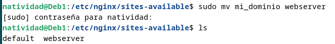

Además se cambiará modificará el nombre de la web en el archivo de configuración. 

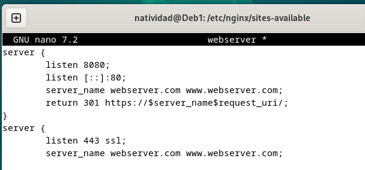

Posteriormente se crea un enlace simbolico llamado webserver 

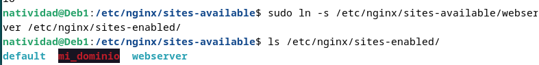

Y se elimina el link simbolico que existía previamente.

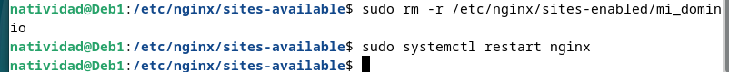

Finalmente se reinicia el sistema nginx para que se apliquen los cambios realizados.

Es importante modificar en el archivo hosts de la máquina anfitriona, cambiando el nombre de la web al actual.

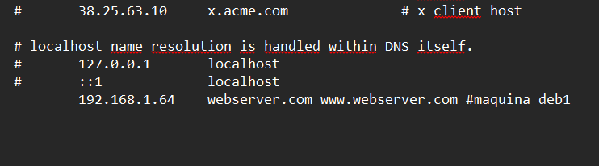

Se comprueba que es posible el acceso a la web tras los cambios y con el nuevo nombre actualizado.

### Nginx proxy inverso

En la máquina clonada, se desarrollará el proxy inverso, que nos redirigirá a `http://webserver:8080`, el servidor web que acabamos de configurar para que escuche con ese nombre en el puerto 8080. 

Para ello se crea un archivo se configuración en la ruta `/etc/nginx/sites-available` que se llamará ejemplo-proxy, y tendrá el siguiente contenido:

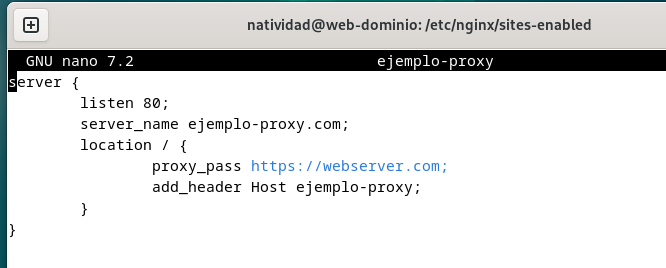

Se detallará el puerto donde está escuchando el proxy inverso(IP), el nombre del sitio web creado anteriormente con el que accedemos en el proxy, y la directiva proxy_pass, que indica donde se redigirán las peticiones

Se realiza la comprobación mediante el navegador web.

Posteriormente se creará el link simbólico pertinente.

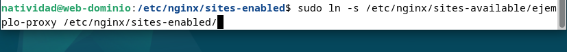

Finalmente se reinicia el sistema para aplicar los cambios aplicados.

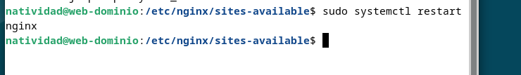

## COMPROBACIONES

En este apartado se pretente comprobar que la petición está pasando por el proxy inverso, que está llegando al servidor web y que vuelve por el mismo camino.
Primeramente se han de hacer las comprobaciones de que es posible acceder a la web.
Posteriormente se añadirán cabeceras HTTP personalizadas para una comprobación más exhaustiva de que las peticiones pasan tanto por el proxy inverso como por el servidor web.
Para ello se editará el archivo de configuración, tanto del webserver como del proxy inverso, añadiendo a cada uno la cabecera host. De tal manera que:

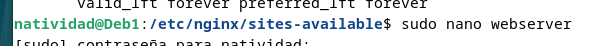
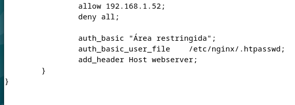

Se añade al bloque `location /` la cabecera para el webserver.

Posteriormente se hace lo mismo para el proxy inverso:

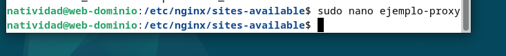
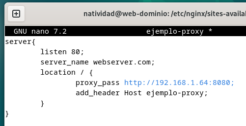

Posteriormente se reinicia el servicio de nginx para aplicar los datos, en ambas máquinas Debian.

El resultado esperado es que, al inspeccionar la web, encontremos ambas cabeceras personalizadas, que nos indicarían que la petición ha pasado por los dos lados.

Además, es importante modificar el archivo `/etc/hosts`de la máquina con el proxy inverso, añadiendo la dirección del servidor web y la IP especifica.

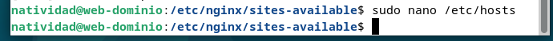
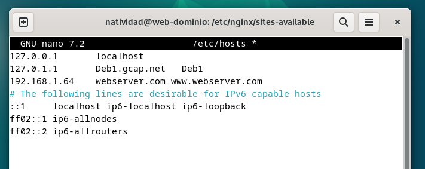

De esta manera, al realizar la comprobación inspeccionando la página se debería obtener el siguiente resultado **( Es importante desactivar la opción de `desactivar caché` para evitar resultados inesperados ).**

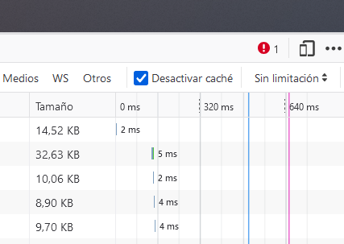
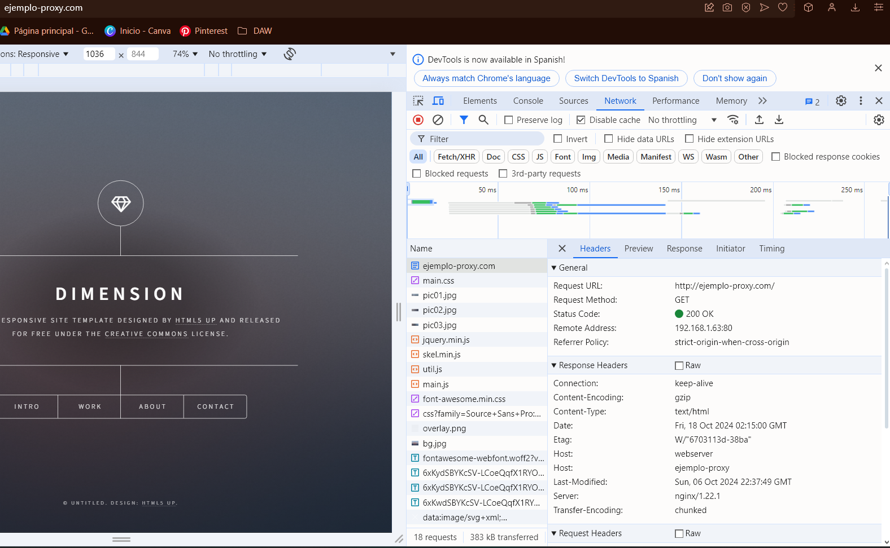

